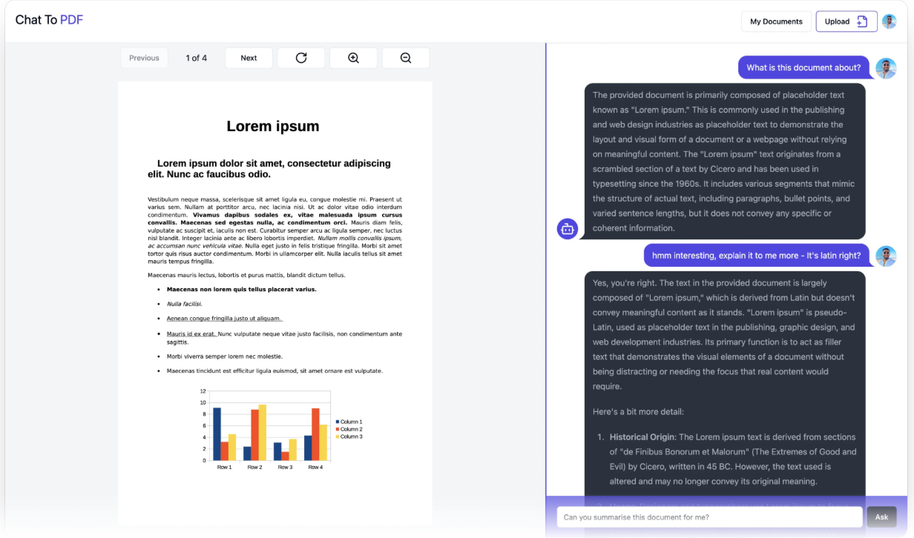

📄 Chat With PDF
Chat With PDF is an innovative application that transforms your static PDF documents into interactive conversational partners. Simply upload a PDF and start asking questions, get instant summaries, and find the information you need through a user-friendly chat interface.

✨ Features
🤖 Interactive PDF Chat: Engage in a natural language conversation with your PDF documents.

📝 Document Summarization: Obtain concise summaries of your PDFs with a single click.

🚀 Easy to Use: A simple and intuitive interface ensures a seamless user experience.

🔒 Secure & Private: Your documents are processed securely, and your privacy is our priority.

🌐 Built with Next.js: A modern, performant, and scalable web application.

Demo
https://chat-with-pdf-dun-psi.vercel.app/

🛠️ Tech Stack
Framework: Next.js

Styling: Tailwind CSS

Font: Geist

🚀 Getting Started
Follow these instructions to get a copy of the project up and running on your local machine for development and testing purposes.

Prerequisites
Ensure you have the following installed on your system:

Node.js (v14 or later)

npm or Yarn

Installation
Clone the repository:

Bash

git clone https://github.com/daardilava/chat-with-pdf.git
Navigate to the project directory:

Bash

cd chat-with-pdf
Install the dependencies:

Bash

npm install
# or
yarn install
Usage
Start the development server:

Bash

npm run dev
# or
yarn dev
Open your browser:
Navigate to http://localhost:3000 to view the application.

Upload a PDF and start your conversation!

🚢 Deploy on Vercel
The easiest way to deploy your Next.js app is to use the Vercel Platform from the creators of Next.js.

Check out our Next.js deployment documentation for more details.

🤝 Contributing
Contributions are what make the open-source community such an amazing place to learn, inspire, and create. Any contributions you make are greatly appreciated.

If you have a suggestion that would make this better, please fork the repo and create a pull request. You can also simply open an issue with the tag "enhancement". Don't forget to give the project a star! Thanks again!

Fork the Project

Create your Feature Branch (git checkout -b feature/AmazingFeature)

Commit your Changes (git commit -m 'Add some AmazingFeature')

Push to the Branch (git push origin feature/AmazingFeature)

Open a Pull Request

📜 License
Distributed under the MIT License. See LICENSE for more information.